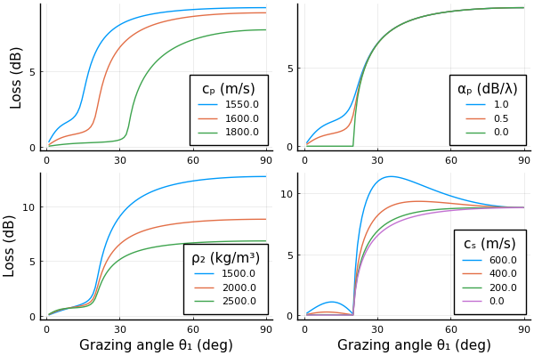

# OceanAcousticsModelling
This package is an implementation of a number of textbooks I study in ocean acoustics modelling.

Notes:
* I still haven't figured out how to produce Julia packages yet.

## Bottom Loss
I've started off simple, replicating the bottom loss curves in Jensen et al [1](#JensenEtAl)

## Ray Tracing

> <a name="JensenEtAl">[1]</a> Jensen, F. B., Kuperman, W. A., Porter, M. B., & Schmidt, H. (2011). Computational ocean acoustics. Springer Science & Business Media.