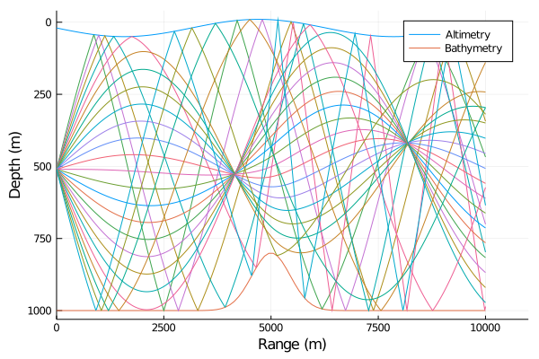

# OceanAcousticsModelling
This package is an implementation of a number of textbooks I study in ocean acoustics modelling.

Notes:
* I still haven't figured out how to produce Julia packages yet.

## Bottom Acoustic Loss
I've started off simple, replicating the bottom loss curves in Jensen et al [[1]](#JensenEtAl).

The bottom loss is dependent on the complex-valued sound speed which includes the volume attenuation in its imaginary component.

It was then simple enough to replicate the bottom loss for various bottom sediments.

## Acoustic Ray Tracing
The Eikonal equation is solved using Julia's [DifferentialEquations.jl](https://github.com/SciML/DifferentialEquations.jl) using the time variable in the solvers for the arc-length.

This first example shows a Gaussian bathymetry and sinusoidal altimetry. The sound speed profile is also range-dependent as a parabola with maximums at the ocean boundaries, which shifts with the changing boundary depths.

I had some rays start at the critical angle which would yield turning points at the boundaries, but that hasn't been demonstrated in the plot.

I still need to perform a few more tests to see if this ray-tracing implementation is "valid" or accurate.

## Receiver Operating Characterisics Curves
Receiver operating charactistics (ROC) curves illustrate the relationship between the probabilities of detection and false alarm in detection theory. The ROC curves for a Gaussian-distributed noise and non-fluctuating signal are replicated here.

## Sonar Equations
For simple ocean propagation with completely absorbing ocean boundaries (just as a simple demonstration), the following plot shows the detection index, the transmission loss, the signal excess and the probability of detection assuming Gaussian noise.

## References
> <a name="JensenEtAl">[1]</a> Jensen, F. B., Kuperman, W. A., Porter, M. B., & Schmidt, H. (2011). Computational ocean acoustics. Springer Science & Business Media.